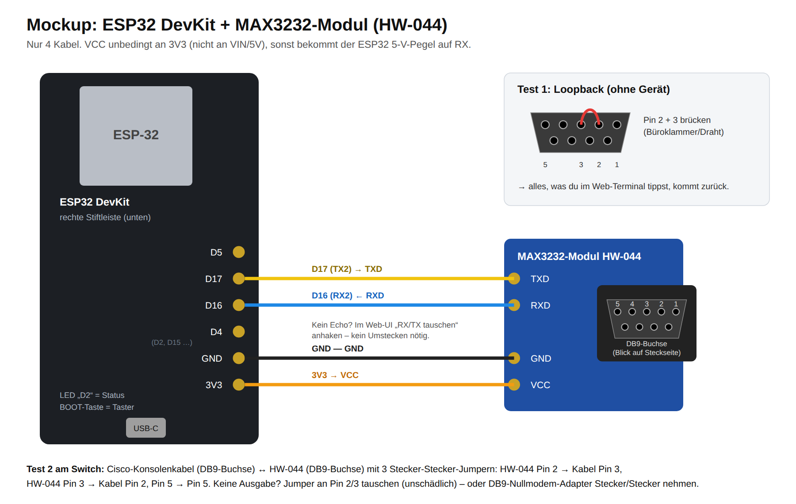
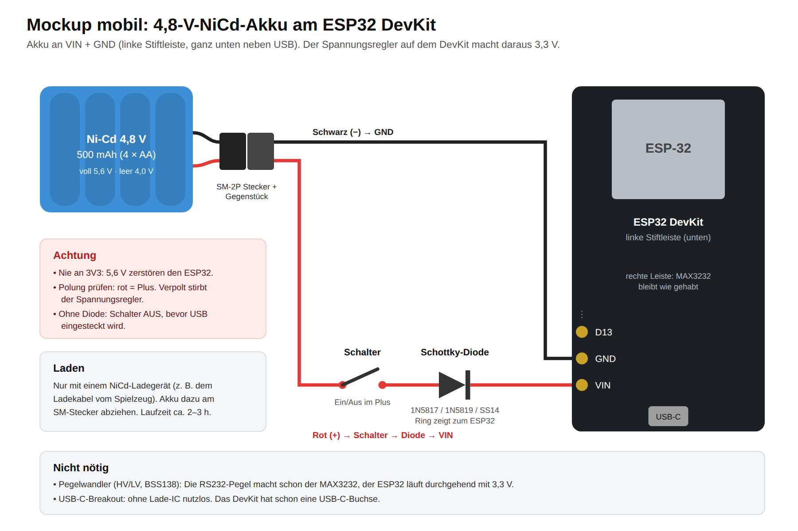
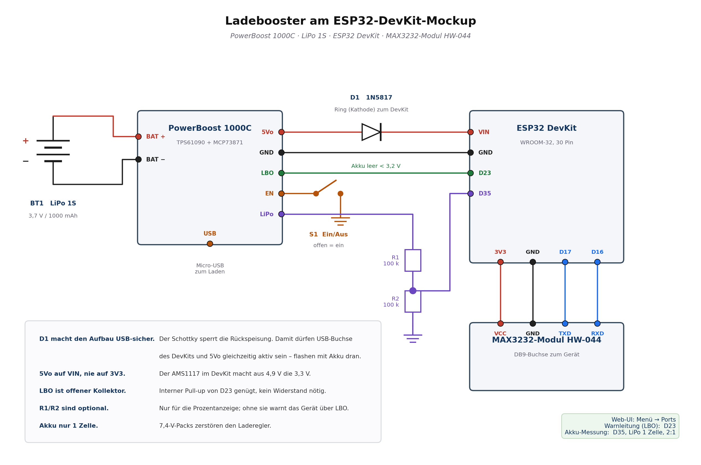
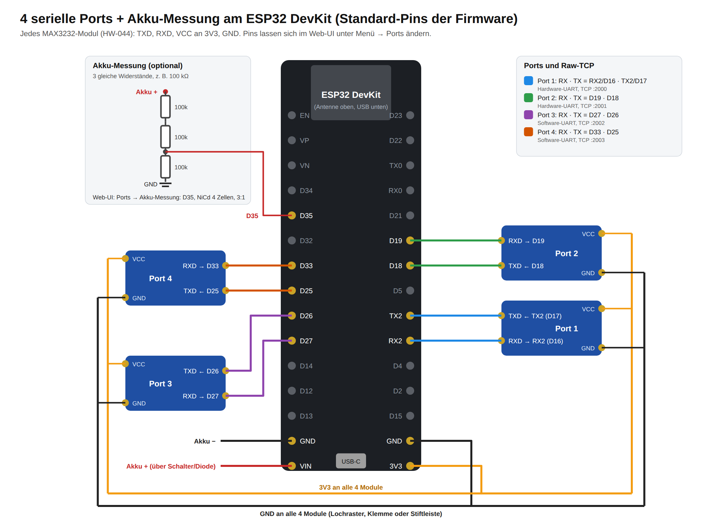

# Mockup: ESP32 DevKit + MAX3232-Modul (HW-044)

Mit dem Mockup prüfst du die Idee, bevor du T-RSS3, Akku und Gehäuse kaufst. Es läuft dieselbe Firmware mit derselben Web-Oberfläche. Es fehlen nur Akku, galvanische Trennung und (optional) das OLED.



## Was du brauchst

- ESP32 DevKit (30 Pin, ESP32-WROOM-32, USB-C mit CH340) und ein bis vier MAX3232-Module HW-044
- 4 Jumper-Kabel Buchse/Buchse und ein USB-C-**Daten**kabel
- Chrome oder Edge am Mac/PC (Safari kann kein Web-Serial)
- für Test 2 zusätzlich: Cisco-Konsolenkabel (RJ45 ↔ DB9-Buchse) **und eine Kreuzung** – entweder ein RJ45-Koppler mit passend belegtem LAN-Kabel, ein DB9-Nullmodem-Adapter Stecker/Stecker oder 3 Jumper Stecker/Stecker (siehe Abschnitt 5)

## 1. Verdrahten: 4 Kabel

| ESP32 DevKit (rechte Leiste, unten) | HW-044 |
|---|---|
| **3V3** | VCC |
| **GND** | GND |
| **D17** (TX2) | TXD |
| **D16** (RX2) | RXD |

> VCC an **3V3**, nicht an VIN/5V: Mit 5 V gibt der MAX3232 5-V-Pegel an den ESP32 zurück, und der verträgt nur 3,3 V.

Ob die Beschriftung TXD/RXD bei deinem Modul „aus Sicht des ESP32“ gemeint ist, siehst du bei Test 1. Falls es andersherum ist, setzt du im Web-UI einen Haken, umstecken musst du nicht.

## 2. Firmware flashen, direkt im Browser

1. ESP32 per USB-C an den Mac anschließen.
2. In Chrome **https://espressif.github.io/esptool-js/** öffnen.
3. Baudrate **460800** wählen und auf **Connect** klicken. Den Port wählen (z. B. „USB Serial“ oder `wchusbserial…`).
   - Verbindet er nicht: **BOOT**-Taste gedrückt halten und erneut Connect klicken.
   - Erscheint kein Port: anderes Kabel probieren (reine Ladekabel gehen nicht) oder den CH340-Treiber von WCH installieren.
4. Flash Address **`0x0`**, Datei **`firmware/rs232-mockup-esp32-devkit_komplett_0x0.bin`**, dann **Program**.
5. Nach „Leaving…“ die **EN**-Taste drücken (Neustart).

Alternativ per Kommandozeile: `esptool.py --chip esp32 write_flash 0x0 rs232-mockup-esp32-devkit_komplett_0x0.bin`
Oder aus dem Quellcode: `pio run -e esp32dev-max3232 -t upload`

## 3. Verbinden

- WLAN **`RS232-XXXX`** (XXXX = Ende der MAC-Adresse), Passwort **`rs232mockup`**
- Das Gerät arbeitet als **Captive Portal** wie ein Hotel-WLAN: Nach dem Verbinden öffnet das Handy die Konsole automatisch.
  - **iPhone:** Das Anmeldefenster zeigt direkt das Terminal. Zum Schließen „Abbrechen“ → **„Ohne Internet verwenden“** wählen, danach geht auch Safari mit `http://192.168.4.1`.
  - **Android:** Auf die Meldung „Im WLAN anmelden“ tippen. Soll es im normalen Chrome laufen, die mobilen Daten kurz ausschalten, weil Android sonst über Mobilfunk statt WLAN geht.
- Manuell: **http://192.168.4.1** (in Safari, nicht in einer App)
- Blaue LED „D2“: kurzes Blinken alle 2 s heißt bereit, Dauerlicht heißt Browser verbunden, Flackern heißt Datenverkehr
- Das Passwort kannst du später unter Menü → Setup ändern.

**Bedienung:** Oben läuft die Ausgabe, unten ist die **Eingabezeile** mit **Senden** (Enter auf der Tastatur geht auch). Eine Zeile wird mit CR abgeschickt, wie bei PuTTY. ↑/↓ holt frühere Befehle zurück, **Tab** und **?** schicken den getippten Text samt Taste gleich mit (Befehlsergänzung bzw. Hilfe am Switch). Für Passwörter und `--More--` tippst du direkt ins schwarze Terminalfeld, dann geht jede Taste sofort raus. Das Zeilenende (CR, CR+LF, LF) stellst du unter Menü → Seriell um.

Am PC ist stattdessen der **Terminal-Modus** voreingestellt (Menü → Sitzung → Darstellung): Eingabezeile und Sondertasten sind ausgeblendet, xterm füllt das ganze Fenster, jede Taste geht sofort raus und der Cursor blinkt, solange die Sitzung steht – wie in PuTTY. Verlauf mit ↑/↓ und Tab-Ergänzung übernimmt dann das angeschlossene Gerät selbst. Am Handy bleibt die Eingabezeile voreingestellt.

## 4. Test 1: Loopback (ohne Gerät)

Am DB9 des HW-044 **Pin 2 und Pin 3 brücken** (Büroklammer, Draht oder Jumper), dann im Web-Terminal tippen.

- **Das Getippte erscheint:** Die ganze Kette funktioniert: Browser → WLAN → ESP32 → MAX3232 → RS232 → zurück.
- **Nichts erscheint:** Menü → **Seriell** → Haken bei „RX/TX am TTL-Pegelwandler tauschen“ → Übernehmen, dann nochmal tippen.
- Ohne Brücke erscheint nichts. Das ist richtig, denn es gibt kein lokales Echo.

## 5. Test 2: echtes Gerät (Switch/Router/Firewall)

> **Die häufigste Falle, bitte zuerst lesen.** Das HW-044 hat eine **DB9-Buchse**, das blaue Cisco-Rollover-Kabel ebenfalls. Zwei Buchsen sind konstruktiv dieselbe Seite: Ein **straighter Gender-Changer** legt Pin 2 auf Pin 2 und Pin 3 auf Pin 3 – damit trifft Sendeausgang auf Sendeausgang, und beide Empfänger hängen in der Luft. Der Loopback-Test aus Abschnitt 4 läuft dabei einwandfrei, am Switch kommt trotzdem nichts. Es muss **gekreuzt** werden.

Zwei Wege, beide erprobt:

**a) Auf der RJ45-Seite kreuzen (am bequemsten).** Einen RJ45-Adapter/Koppler mit einem passend belegten LAN-Kabel kombinieren, sodass die beiden Datenadern getauscht sind. Weil das Rollover-Kabel RJ45 3 → DB9 2 und RJ45 6 → DB9 3 führt, landet die Kreuzung am Ende an derselben Stelle – ohne an zwei DB9-Buchsen herumzustecken.

**b) Am DB9 kreuzen.** Nullmodem-Adapter Stecker/Stecker statt des straighten Changers, oder für den schnellen Test drei Jumper Stecker/Stecker:

| HW-044 (Buchse) | Cisco-Kabel DB9 (Buchse) |
|---|---|
| Pin 2 (TX des Moduls) | Pin 3 (TXD, Richtung Switch) |
| Pin 3 (RX des Moduls) | Pin 2 (RXD, vom Switch) |
| Pin 5 | Pin 5 (GND) |

Danach im Web-UI Enter drücken bzw. **Auto-Baud** wählen.

- **Pin-Nummern:** Bei einer **Buchse** von vorn liegt Pin 1 **oben rechts**, spiegelverkehrt zum Stecker. Die meisten DB9 haben 1/5/6/9 winzig eingeprägt.
- **Prüfen per Multimeter:** Der Pin, der gegen Pin 5 etwa **−5 V** zeigt, ist der TX-Ausgang des Moduls (RS232 ruht negativ). Der gehört auf Pin 3 der Kabelbuchse.
- **Auto-Baud als Diagnose:** „Leitung stumm – kein einziges Byte“ heißt Kreuzung oder Masse fehlt. „nur unlesbare Zeichen (max. N Byte)“ heißt, die Verdrahtung stimmt und es geht nur noch um Datenbits/Parität.
- **Nichts geht kaputt:** RS232-Treiber sind kurzschlussfest, zwei gegeneinander sendende Ausgänge halten das folgenlos aus.
- **Gegenprobe ohne Switch:** Ein USB-RS232-Adapter (DB9-Stecker) passt direkt auf das HW-044. Am Mac `screen /dev/tty.usbserial-XXXX 9600` starten: Was du am Handy tippst, erscheint am Mac und umgekehrt.

> Das Häkchen **„RX/TX am TTL-Pegelwandler tauschen“** hilft hier *nicht*. Es vertauscht die beiden Leitungen zwischen ESP32 und Pegelwandler (für den Fall, dass die Beschriftung TXD/RXD am Modul andersherum gemeint ist) – welcher DB9-Pin sendet, legt das Modul-Layout fest.

## 6. Mobil mit Akku (4,8-V-NiCd-Pack)



| von | über | an DevKit |
|---|---|---|
| Akku **rot (+)** | Schalter, dann Schottky-Diode (1N5817/1N5819/SS14, Ring zum ESP32) | **VIN** (linke Leiste, ganz unten) |
| Akku **schwarz (−)** | direkt | **GND** (linke Leiste, darüber) |

- Der Regler auf dem DevKit (AMS1117) braucht rund 1,1 V mehr als die 3,3 V. Der Pack liefert 5,6 V (voll) bis 4,0 V (leer), das reicht bis fast zum Ende.
- Die Diode verhindert, dass bei eingestecktem USB Strom in den Akku oder aus dem Akku in den PC fließt. Ohne Diode gilt: Schalter aus, bevor USB dran kommt.
- Nie an 3V3 anschließen. Laden nur mit einem NiCd-Ladegerät, Akku dazu abstecken. Laufzeit ca. 2–3 h.
- Pegelwandler und USB-C-Breakout brauchst du dafür nicht.

**Akku-Anzeige:** Ohne Messung weiß das Gerät nicht, ob es am Akku oder an USB hängt, deshalb zeigt es dann gar keine Akku-Anzeige. Zum Messen braucht es einen Spannungsteiler an einem Mess-Pin: 3 gleiche Widerstände (z. B. 100 kΩ), zwei in Reihe von Akku-Plus zu **D35**, einer von D35 nach GND (Bild unten links). Danach im Web-UI unter **Menü → Ports → Akku-Messung**: „D35“, „NiCd/NiMH 4 Zellen“, „3:1“. Die Anzeige ist bei NiCd nur grob, weil die Spannung lange flach bei 4,8 V bleibt.

## 6b. Alternative: LiPo mit Ladeteil (Adafruit PowerBoost 1000C)

Statt NiCd-Pack plus Diode geht auch ein Lade-/Boost-Board. Es lädt einen 1-zelligen LiPo über seine eigene Micro-USB-Buchse, erzeugt daraus 5,2 V und kann dabei gleichzeitig weiterversorgen.

> **Nur LiPo/Li-Ion mit einer Zelle.** Das 4,8-V-NiCd-Pack darf nicht an dieses Board – der Laderegler lädt fest auf 4,2 V. Steht auch so auf der Platinenrückseite.



| PowerBoost | DevKit | wofür |
|---|---|---|
| **5Vo** | **VIN** | Versorgung (der AMS1117 auf dem DevKit macht daraus 3,3 V) |
| **GND** | **GND** | Masse |
| **LBO** | **D23** | Akkuwarnung, offener Kollektor, zieht unter 3,2 V auf Masse |
| **EN** | – | Schalter nach GND = aus |

Der LiPo kommt an die **BAT**-Buchse (JST-PH), nicht an 5Vo.

- **Nicht gleichzeitig** über die USB-Buchse des DevKits und über 5Vo versorgen – zwei 5-V-Quellen gegeneinander. Zum Flashen entweder den EN-Schalter auf aus, oder eine Schottky-Diode von 5Vo nach VIN setzen (Ring zum DevKit), dann ist es egal.
- **Laufzeit:** mit 2500 mAh etwa 8 h, gegenüber 2–3 h beim NiCd-Pack.
- **LBO im Web-UI aktivieren:** Menü → Ports → **Warnleitung (LBO)** auf D23. Danach warnt das Gerät anhand dieser Leitung – auch ohne Spannungsteiler.
- **Prozentanzeige zusätzlich:** LiPo-Pin → 100 kΩ → D35 → 100 kΩ → GND, dann Menü → Ports → Akku-Messung: **D35, LiPo 1 Zelle, 2:1**. Bei LiPo ist die Prozentanzeige brauchbar, anders als beim flachen NiCd-Verlauf.

## 7. Bis zu 4 serielle Ports



| Port | RX-Pin (an Modul-RXD) | TX-Pin (an Modul-TXD) | Art | Raw-TCP |
|---|---|---|---|---|
| 1 | RX2 / D16 | TX2 / D17 | Hardware-UART | 2000 |
| 2 | D19 | D18 | Hardware-UART | 2001 |
| 3 | D27 | D26 | Software-UART | 2002 |
| 4 | D33 | D25 | Software-UART | 2003 |

1. Jedes weitere HW-044-Modul wie Port 1 anschließen: VCC an 3V3, GND an GND, TXD und RXD an die Pins aus der Tabelle. 3V3 und GND gibt es am DevKit nur einmal bzw. zweimal, also über ein Stück Lochraster, eine Wago-Klemme oder eine Stiftleiste verteilen.
2. Im Web-UI **Menü → Ports**: Port anhaken, Namen vergeben (z. B. „Core-SW“), Pins bei Bedarf ändern, **Speichern & Neustart**. Doppelt belegte Pins markiert die Seite rot. Unter jeder Karte steht, wie das Modul verdrahtet wird.
3. Oben erscheint dann eine Leiste mit einem Reiter pro Port. Jeder Port hat sein eigenes Terminal, seine Einstellungen und seinen Mitschnitt. Ein grüner Punkt am Reiter heißt: Da kam neue Ausgabe.

Die Raw-TCP-Ports erreichst du mit PuTTY (Verbindungstyp „Raw“ oder „Telnet“), `nc` oder `telnet` – Telnet-Aushandlung filtert die Firmware heraus. Ab Werk nur aus dem eigenen Hotspot erreichbar; hängt das Gerät zusätzlich im WLAN und du willst aus dem LAN drauf, setzt du unter Menü → Setup den Haken **„auch aus dem LAN erreichbar“**. Achtung: Raw-TCP kennt keine Anmeldung, und die jeweils neueste Verbindung verdrängt die bestehende.

Der ESP32 hat nur 3 Hardware-UARTs und einer davon hängt am USB. Ports 3 und 4 laufen deshalb als Software-UART: bis 38400 Baud, für Konsolen (meist 9600) reicht das. Nur ADC1-Pins (D32–D39) können die Akkuspannung messen, D34–D39 taugen nur als RX.

## 8. Dateien per XMODEM / YMODEM senden

Für ROMmon-Recovery, IOS-Images oder U-Boot: **Menü → Sitzung → Datei senden**.

1. Am Gerät den Empfang starten, z. B. Cisco ROMmon `xmodem -c flash:image.bin`, IOS `copy xmodem: flash:`, U-Boot `loadx` / `loady`.
2. Datei wählen, Protokoll wählen, **Senden**. Die Reihenfolge ist egal: Das Gerät wartet bis zu 2 Minuten auf den Empfänger (Zeichen „C“ bzw. NAK).
3. Unten zeigt ein Balken Fortschritt, Tempo und Wiederholungen. **Abbrechen** sendet CAN an den Empfänger.

| Protokoll | Blöcke | wann |
|---|---|---|
| XMODEM-1K | 1024 Byte, CRC | Standard. Kann der Empfänger keine 1K-Blöcke, schaltet die Firmware selbst auf 128 Byte um |
| XMODEM | 128 Byte, CRC oder Prüfsumme | alte Geräte |
| YMODEM | 1024 Byte + Dateiname und Größe | U-Boot `loady`, Geräte die den Namen wollen |

Das Protokoll läuft im ESP32, der Browser liefert nur die Daten nach. WLAN-Aussetzer bremsen den Ablauf deshalb nicht, und reißt die Verbindung kurz ab, macht die Seite nach dem Wiederverbinden weiter. Das Display dabei anlassen. Tempo: bei 115200 Baud etwa 10 kB/s, bei 9600 Baud knapp 1 kB/s (für große Images vorher im ROMmon die Baudrate hochsetzen, z. B. `xmodem -c -s 115200 …`, und dann im Web-UI ebenfalls 115200 einstellen).

## 9. Konfigurationen abspielen (Provisionierung)

**Menü → Konfig**: Konfigurationen auf dem Gerät speichern und per Klick auf den aktiven Port abspielen. Beim DevKit ist rund 100 kB Platz (bei der T-RSS3 über 1 MB), eine Konfiguration darf bis 32 kB groß sein. Der Werksreset löscht sie nicht.

```
@expect initial configuration dialog
no
@expect Switch>
enable
configure terminal
hostname {{HOSTNAME}}
interface GigabitEthernet1/0/48
 description {{UPLINK}}
end
write memory
```

- Jede Zeile geht mit Enter raus. Im Modus **„auf Prompt warten“** wartet die Seite nach jeder Zeile, bis das Gerät wieder einen Prompt zeigt (`#`, `>`, `:` …). `--More--` wird automatisch weitergeblättert. Alternativ **feste Pause** pro Zeile.
- `{{NAME}}` sind Platzhalter: Vor dem Start fragt ein Dialog die Werte ab und merkt sich die letzten Eingaben.
- Steuerzeilen: `@expect Text` wartet auf eine Ausgabe (Groß/klein egal), `@pause 5` wartet 5 s, `@break` sendet BREAK, `@timeout 120` setzt die Wartezeit für die folgenden Zeilen (Standard 30 s).
- **Bei Fehlermeldung anhalten** (Standard an): Bei `% Invalid input`, `% Incomplete command`, `Command fail` usw. stoppt die Wiedergabe und nennt die Zeile.
- „Datei laden“ übernimmt eine Textdatei vom Handy in den Editor.

## 10. Firmennetz: 802.1X und HTTPS (Menü → Netz)

Der Tab **Netz** bündelt WLAN-Client, Zertifikate und HTTPS.


**EAP-TLS in drei Schritten**

1. **Zertifikate hochladen.** Client-Zertifikat mit Schlüssel (meist `.p12`/`.pfx` aus der Firmen-PKI, Passwort ins Feld daneben) und das **CA-Zertifikat** der Stelle, die das RADIUS-Zertifikat ausgestellt hat. Windows-Exporte mit „TripleDES-SHA1“ liest die Firmware genauso wie die neuen mit AES-256.
2. **WLAN einstellen.** SSID eintragen, Sicherheit „WPA2/WPA3-Enterprise · EAP-TLS“, optional die äußere Identität (leer = CN aus dem Zertifikat). „RADIUS-Server prüfen“ anlassen.
3. **Speichern & Neustart.** Danach zeigt Menü → Gerät die LAN-IP. Klappt die Anmeldung nicht, steht dort der Grund, z. B. `Grund 23: 802.1X abgelehnt (Zertifikat/Identität prüfen)`.

Kein Zertifikat aus der PKI zur Hand? Unter **„Antrag erzeugen“** macht das Gerät Schlüssel und CSR selbst (RSA 2048 dauert auf dem DevKit ~30 s, ECDSA P-256 ist in einer Sekunde fertig). Der Antrag wird heruntergeladen, von der CA signiert und das Zertifikat wieder hochgeladen – der Schlüssel bleibt dabei im Gerät.

**HTTPS**

„HTTPS auf Port 443 einschalten“ genügt: Ohne hochgeladenes Zertifikat erzeugt das Gerät beim ersten Start eine eigene kleine CA und ein Serverzertifikat für `rs232`, `rs232.local`, `192.168.4.1` und die LAN-IP. Am iPhone einmal **Geräte-CA herunterladen**, das Profil installieren und unter *Einstellungen → Allgemein → Info → Zertifikatsvertrauenseinstellungen* einschalten – danach ist `https://rs232.local/` grün und auch das Terminal (WSS) läuft verschlüsselt. Wer ein Zertifikat der Firmen-PKI hochlädt (mit *serverAuth* und passendem SAN), braucht das nicht.

Mit **„Im Firmennetz nur HTTPS zulassen“** wird HTTP aus dem LAN auf HTTPS umgeleitet; im Hotspot bleibt HTTP erreichbar, damit die Anmeldeseite am Handy weiter aufgeht.

> Die privaten Schlüssel liegen unverschlüsselt im Flash. Für das Mockup egal, im Firmennetz gilt: eigenes Gerätezertifikat, das sich sperren lässt, und ein Web-Passwort setzen.

## Was das Mockup zeigt und was nicht

| getestet | nicht getestet (erst mit T-RSS3) |
|---|---|
| Web-Terminal am Handy inkl. Sondertasten, Break, Auto-Baud, Log, bis zu 4 Ports | galvanisch getrennte RS232 (RSM232-Modul) |
| WLAN-Hotspot, Reconnect mit Replay, Raw-TCP :2000–2003, XMODEM/YMODEM, Konfigurationen | Li-Ionen-Akku mit Laden |
| Konsolenzugriff auf echte Geräte | Gehäuse |
| 802.1X (EAP-TLS/PEAP/TTLS), Zertifikats-Upload, CSR, HTTPS/WSS | Anmeldung an einem echten RADIUS-Server |
| optional OLED: SSD1306 an **D21 (SDA) / D22 (SCL)**, 3V3, GND, Helligkeit unter Menü → Setup | |

Die **BOOT**-Taste dient als Bedientaste (kurz = OLED-Seite, lang = Baudrate). Ein Werksreset geht beim DevKit nur übers Web-UI (Setup → Werksreset): Wer BOOT beim Einschalten hält, landet im Flash-Modus.

## Seite lädt nicht? Diagnose

1. **http://192.168.4.1/ping** öffnen. Das ist reiner Text ohne JavaScript. Kommt „OK RS232 Web Console …“ zurück, läuft der Webserver. `dns N` zeigt, wie viele Namensanfragen das Captive Portal schon beantwortet hat.
2. **Serielle Konsole** (115200 Baud, z. B. im esptool-js-Console-Tab) mitlaufen lassen. Die Firmware protokolliert:

   | Zeile | Bedeutung |
   |---|---|
   | `[WLAN] … Belegung Kanal 1/6/11: … -> Kanal 11` | Beim Start sucht sich der Hotspot den freiesten Kanal |
   | `[WLAN] Hotspot RS232-XXXX auf Kanal 11, Sendeleistung 8.5 dBm` | Hotspot läuft |
   | `[WLAN] Client hat IP 192.168.4.2` | Handy ist im WLAN |
   | `[dns] captive.apple.com A -> 192.168.4.1` | Handy fragt den Namensdienst des Geräts (Hotspot-Erkennung) |
   | `[HTTP]   -> captive redirect …` | Handy wird auf die Konsole umgeleitet |
   | `[HTTP] 192.168.4.2 GET http://192.168.4.1/` und `-> 200 136682 Bytes in 180 ms` | Seite ausgeliefert, mit Dauer |
   | `[HTTP] …: leere Verbindung verworfen` | Browser hatte eine Reserve-Verbindung offen, harmlos |
   | `[WS]   client 0 connected` | Terminal verbunden |

   **Kein `[HTTP]`-Eintrag beim Aufruf:** Der Aufruf erreicht das Gerät nicht. Das Handy schickt ihn dann über Mobilfunk: mobile Daten aus bzw. „Ohne Internet verwenden“. Bei Chrome auf dem iPhone muss außerdem die Berechtigung „Lokales Netzwerk“ erlaubt sein.
   **Keine `[dns]`-Zeilen nach dem Verbinden:** Das Handy fragt einen anderen Namensdienst, typisch bei Firmen-iPhones mit VPN oder DNS-Profil. Die Hotspot-Seite erscheint dann nicht automatisch, `http://192.168.4.1` von Hand geht trotzdem.
   **`-> 200 …` dauert mehrere Sekunden oder `Client getrennt` direkt danach:** Funkproblem. Unter Menü → Setup einen festen Kanal (1/6/11) wählen oder die Sendeleistung erhöhen. Das Handy nicht direkt auf die Antenne legen.

## Update

Menü → Setup → Firmware-Update → `firmware/rs232-mockup-esp32-devkit_ota-update.bin`. So bleiben Einstellungen und Passwort erhalten. Die Komplett-Datei (`…komplett_0x0.bin` per esptool-js) setzt dagegen die Einstellungen zurück.
