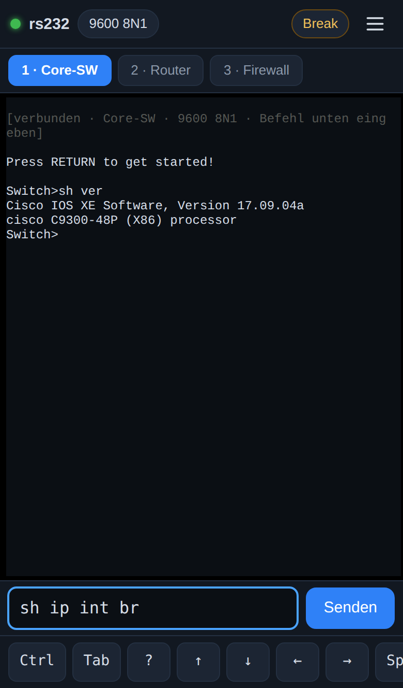
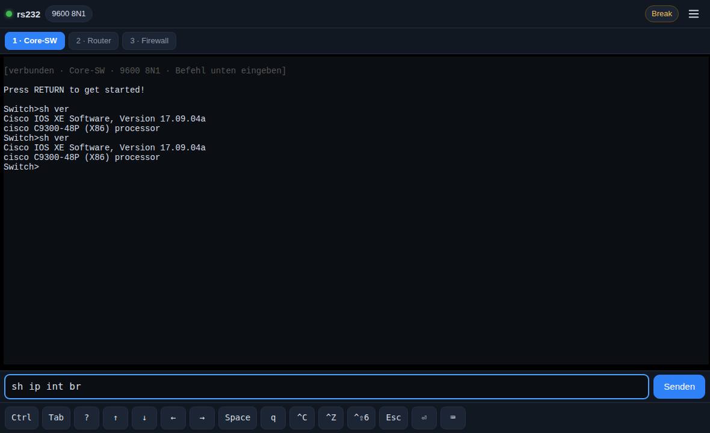
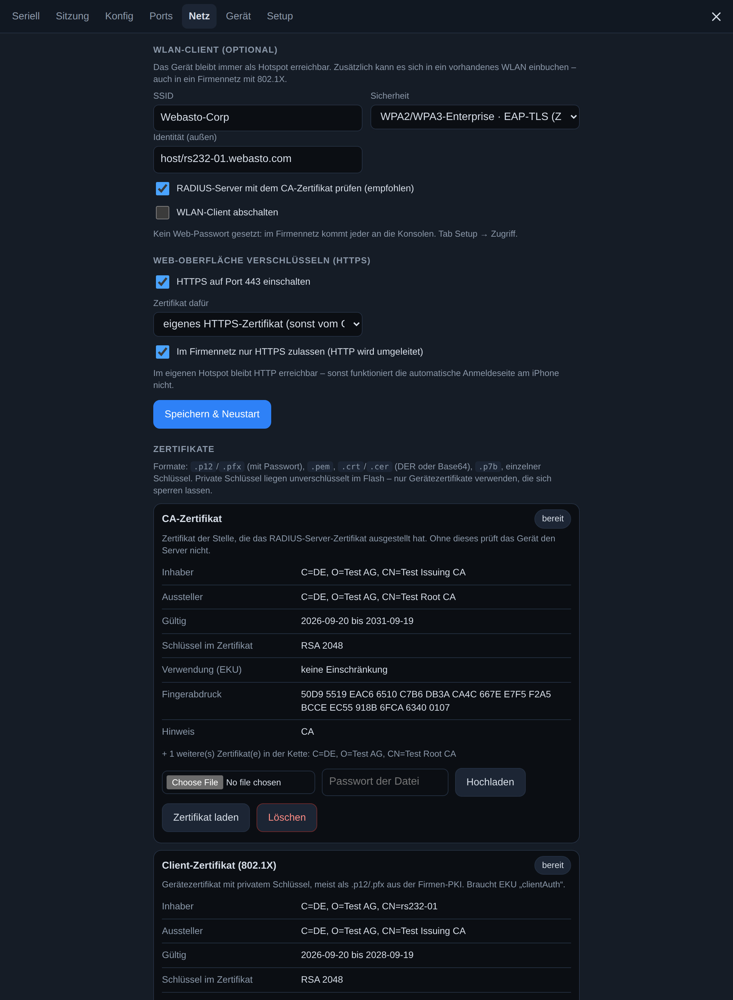

# RS232 Web Console

Mobiler serieller Konsolenzugang per WLAN auf dem **Waveshare ESP32-S3-Touch-LCD-2**: ESP32-S3 mit 2″-Touch-Display, Akkuanschluss, SD-Slot und Web-Terminal im Browser. Du verbindest dein Handy oder Notebook mit dem Hotspot des Geräts und öffnest `http://192.168.4.1`. Eine App ist nicht nötig.

Alles zum Board selbst — Touch-Oberfläche, Bluetooth, Pins, Akku, Stromsparen, Debug-Konsole, offene Punkte — steht in **[WAVESHARE.md](WAVESHARE.md)**. Dieses Dokument beschreibt die Weboberfläche und die Netzfunktionen.



## Funktionen

- **Web-Terminal** (xterm.js, offline im Flash eingebettet) mit **Eingabezeile + Senden** und Befehlsverlauf (↑/↓), dazu eine Sondertasten-Leiste fürs Handy: Ctrl (einrastend), Tab, `?`, Pfeiltasten, Space, `q`, ^C, ^Z, Ctrl-Shift-6, Esc
- **Break senden** (250/500/1000 ms) für ROMmon/Passwort-Recovery. In der Kopfzeile musst du zweimal tippen, damit nichts versehentlich ausgelöst wird.
- **Auto-Baud**: probiert 9600, 115200, 19200, 38400 und 57600 mit einem Enter durch.
- **Mitschnitt**: die komplette Sitzung (bis 8 MB) als `.log` speichern, auf Wunsch bereinigt (ohne `--More--`, Backspaces und ANSI-Codes).
- **Bis zu 4 serielle Ports** mit je eigenem Terminal-Reiter, Namen, Einstellungen, Mitschnitt und Raw-TCP-Port (2000–2003). Die GPIOs weist du im Web-UI zu (Menü → Ports). Am Waveshare-Board sind bisher nur IO44/IO21 freigegeben, praktisch also ein Port.
- **Dateien senden per XMODEM, XMODEM-1K und YMODEM** (ROMmon-Recovery, U-Boot `loadx`/`loady`). Das Protokoll läuft im ESP32, der Browser streamt nur die Datei.
- **Konfigurationen** auf dem Gerät speichern und per Klick abspielen: wartet auf den Prompt, fragt `{{Platzhalter}}` ab, `@expect`/`@pause`/`@break`, stoppt bei `% Invalid input`.
- **Wiederverbinden ohne Datenverlust**: Das Gerät puffert die letzten 16 kB. Nach einem WLAN-Abbruch bekommt der Browser genau die verpassten Bytes nachgeliefert.
- **Mehrere Clients** gleichzeitig (bis 5 Browser). Dazu **Raw-TCP** (Port 1 = 2000, Port 2 = 2001 …) für PuTTY („Raw“), SecureCRT oder `nc`.
- **Touch-Display** mit Status, Terminal, WLAN-QR (Handy-Kamera → automatisch verbinden), URL-QR und Einstellungen; dazu eine **Bluetooth-LE-Konsole** — siehe [WAVESHARE.md](WAVESHARE.md)
- **Akkuanzeige** in Prozent und mV auf dem Display und im Web, mit Ladeerkennung und Kalibrierung.
- **Firmennetz (802.1X):** WLAN-Client mit **WPA2/WPA3-Enterprise** – EAP-TLS mit Zertifikat (`.p12`/`.pfx`, `.pem`, `.p7b`), PEAP-MSCHAPv2 oder EAP-TTLS. Zertifikate lädst du im Web-UI hoch, Schlüsselpaar und Zertifikatsantrag (CSR) kann das Gerät auch selbst erzeugen.
- **HTTPS für die Web-Oberfläche** (Port 443, TLS 1.2) mit eigenem Zertifikat – wahlweise dem 802.1X-Zertifikat – oder einem, das sich das Gerät selbst ausstellt. Im Firmennetz lässt sich HTTP auf HTTPS umleiten.
- **Hotspot mit Captive Portal:** Das Handy öffnet die Konsole nach dem Verbinden automatisch. Der Hotspot wählt beim Start den freiesten Kanal (1/6/11), Kanal und Sendeleistung sind im Setup einstellbar. Optional zusätzlich WLAN-Client (z. B. Labor-WLAN), mDNS `http://rs232.local`, Diagnose unter `/ping`
- **Leitstelle:** Das Gerät meldet sich auf Wunsch bei einem Server im Netz, der es verwaltet und ihm Aufträge geben kann — über HTTPS, darin ein eigener Kanal mit Post-Quanten-Schlüsseltausch (ML-KEM-768). Siehe [Leitstelle](#leitstelle).
- **Firmware-Update per Browser** (OTA)

## Teststand

Die Tests der Weboberfläche und der Netzfunktionen stammen aus der Zeit vor dem Waveshare-Board; sie prüfen Code, der unverändert weiterläuft.

| Bereich | Stand |
|---|---|
| Web-UI | 35 automatisierte Tests im Headless-Chromium (iPhone-Profil) gegen den Geräte-Simulator (`tools/mock_device.js`), keine JS-Fehler |
| Firmware am PC | Der echte C++-Code (WebServer, WebSockets, Captive-DNS, Replay, 4 Ports, XMODEM/YMODEM, Konfig-Speicher) läuft am PC gegen nachgebildetes WLAN und serielle Leitungen mit echter Baudrate. Getestet mit Chromium (iPhone-Profil) und **WebKit, der Engine von Safari** |
| XMODEM/YMODEM | Übertragungen in die echten Linux-Empfänger `rx` und `rb` (lrzsz): XMODEM-1K, XMODEM mit Prüfsumme, YMODEM mit Name und exakter Größe, eingestreute CRC-Fehler, verirrte NAKs während eines Blocks, Empfänger ohne 1K-Blöcke, Abbruch durch Empfänger und Benutzer, WLAN-Abriss mit Fortsetzung. Dateien bitgenau verglichen |
| Captive Portal | DNS-Antwortlogik am PC mit echten DNS-Paketen getestet (A, AAAA, HTTPS-Typ, EDNS) |
| Zertifikate | 68 Tests gegen mit OpenSSL erzeugte Dateien: PKCS#12 mit AES-256 und mit 3DES/RC2 (alte Windows-Exporte), ohne Passwort, ohne MAC, mit Umlaut-Passwort, PEM/DER/PKCS#7, verschlüsselte Schlüssel (PKCS#8 mit AES/3DES, klassisch mit AES/3DES), falsche Passwörter, nicht passende Schlüssel, Ed25519, CSR auf dem Gerät (Signatur mit OpenSSL geprüft, von einer Test-CA signiert und wieder eingespielt) |
| 802.1X / HTTPS | am PC: Zertifikats-Upload über die Web-Oberfläche, an den Supplicant übergebene PEM-Puffer, HTTPS-Seite und Terminal über `wss://` in Chromium **und WebKit (Safari-Engine)**, Prüfung der Kette gegen die Geräte-CA, HTTPS-Zwang im LAN, Lasttest (40 Anfragen nacheinander, 6 parallel, 58 kB über eine TLS-Sitzung, kein Leerlauf-Spin). **Anmeldung an einem echten RADIUS-Server steht noch aus** |
| **Echte Hardware** | siehe [WAVESHARE.md](WAVESHARE.md). Der serielle Port ist am Waveshare-Board noch ohne MAX3232, ein Konsolenzugriff auf ein echtes Gerät steht dort aus |

## Firmware flashen

```bash
pio run -t upload            # Umgebung waveshare-s3-lcd2, Arduino-ESP32 2.0.17
```

Board per USB-C anschließen. Libraries und Toolchain lädt PlatformIO selbst; die Web-UI wird beim Build aus `web/` nach `src/web_assets.h` gepackt. Falls der Upload nicht startet: **BOOT** halten, **RST** kurz drücken, BOOT loslassen, dann erneut. Der serielle Monitor (115200) zeigt beim Start SSID, Passwort und URL.

Spätere Updates gehen ohne Kabel: Web-UI → Menü → **Setup** → Firmware-Update → `.pio/build/waveshare-s3-lcd2/firmware.bin` hochladen. Einstellungen und Passwort bleiben dabei erhalten.

## Erste Inbetriebnahme

1. Einschalten. Das Gerät erzeugt einen Hotspot **`RS232-XXXX`**; das Passwort ist ab Werk `rs232mockup` (`FIXED_AP_PASS` in `src/config.h`) und lässt sich im Setup ändern.
2. Auf dem Display zur Seite **WLAN** wischen und den QR-Code mit der Handy-Kamera scannen.
3. Nächste Seite: **Web-UI-QR** scannen oder `http://192.168.4.1` öffnen.
4. Android fragt eventuell „Internet nicht verfügbar“ → **Verbindung beibehalten**. iOS bleibt trotz „Kein Internet“ verbunden.

## Bedienung

Die Bedienung am Gerät (Touch-Display, BOOT-Taste) beschreibt [WAVESHARE.md](WAVESHARE.md#bedienung).

**Web-UI**
- **Eingabezeile** unten: Befehl tippen, **Senden** oder Enter. Die Zeile geht mit CR raus (umstellbar unter Seriell). ↑/↓ = Verlauf, **Tab** und **?** schicken den getippten Text plus Taste (Befehlsergänzung/Hilfe am Switch).
- Direkt ins Terminal tippen geht auch: Jede Taste geht sofort raus, gut für Passwörter und `--More--`. Die Leiste unten liefert Tab, `?`, Pfeile usw. **Ctrl** rastet für eine Taste ein (Ctrl → `z` = ^Z). **⌨** blendet die Tastatur ein oder aus.
- Oben: Verbindungspunkt · Baud-Chip des aktiven Ports (öffnet die seriellen Einstellungen) · Akku (nur mit Messung) · **Break** (2× tippen) · Menü. Darunter bei mehreren Ports ein Reiter pro Port.
- Menü: **Seriell** (Baud, Format, Auto-Baud, Break-Dauer des aktiven Ports) · **Sitzung** (Log, Schriftgröße, Datei senden per XMODEM/YMODEM) · **Konfig** (gespeicherte Konfigurationen abspielen) · **Ports** (Pins, Namen, Akku-Messung) · **Gerät** (Status) · **Setup** (WLAN, Passwort, Display, Firmware-Update, Werksreset)
- Tipp: Im Querformat passen auf dem Handy 80+ Spalten.

**Notebook:** Die Web-UI funktioniert genauso im Browser. Alternativ gibt es Raw-TCP: `nc 192.168.4.1 2000` oder PuTTY mit Verbindungstyp **Raw**, Port 2000 (Port 2 = 2001 usw.). Break geht nur über die Web-UI.



## Einstellungen & Sicherheit

- **Hotspot:** WPA2. Das Passwort ist ab Werk fest (`FIXED_AP_PASS`); ohne diese Vorgabe erzeugt die Firmware ein zufälliges 10-Zeichen-Passwort. Es steht auf dem Display (Seite WLAN), du kannst es im Setup ändern.
- **Zusätzlich ins WLAN einbuchen:** Netz → SSID/Sicherheit. Das Gerät ist dann auch über die LAN-IP erreichbar (steht auf dem Display), der Hotspot bleibt aktiv. Der Hotspot wechselt dabei auf den Kanal des WLANs, Handys verbinden sich kurz neu.
- **Web-Passwort** (Benutzer `admin`): Ist im LAN-Betrieb dringend zu empfehlen. Es schützt Web-UI, Terminal (Session-Token), Einstellungen und OTA.
- **Raw-TCP** hat keine Authentifizierung. Solange das Gerät im LAN hängt, nimmt es TCP-Verbindungen deshalb **nur von Hotspot-Clients** an. Abschaltbar im Setup.
- HTTP im Hotspot ist unverschlüsselt, den Schutz übernimmt die WLAN-Verschlüsselung. Im Firmennetz kannst du HTTPS erzwingen (siehe unten).

## Firmennetz: 802.1X und HTTPS

Alles dazu steht im Web-UI unter **Menü → Netz**.



### WLAN-Client mit 802.1X

| Verfahren | Was das Gerät braucht |
|---|---|
| WPA2/WPA3-Personal | SSID + Passwort |
| **EAP-TLS** (zertifikatsbasiert) | Client-Zertifikat **mit privatem Schlüssel** (Slot „Client“), dazu das CA-Zertifikat des RADIUS-Servers |
| PEAP-MSCHAPv2 | Benutzer + Passwort, CA-Zertifikat empfohlen |
| EAP-TTLS (MSCHAPv2 oder PAP) | Benutzer + Passwort, CA-Zertifikat empfohlen |

- **Identität (außen)**: Wenn leer, nimmt das Gerät bei EAP-TLS den CN aus dem Zertifikat, sonst den Benutzernamen.
- **RADIUS-Server prüfen**: Mit hinterlegtem CA-Zertifikat prüft das Gerät die Zertifikatskette des Servers. Einen Abgleich des Servernamens (Domain-Match) kann das ESP32-SDK 4.4 nicht, die Kette wird also gegen die CA geprüft, nicht gegen einen konkreten Servernamen.
- **WPA3-Enterprise**: WPA2/WPA3-Transition-Netze funktionieren (PMF wird unterstützt). Der **192-Bit-Modus (Suite B)** ist in diesem SDK nicht aktiviert, ein Netz, das ausschließlich Suite B erlaubt, geht damit nicht.
- Nach dem Hochladen eines neuen Zertifikats meldet sich das WLAN erst nach einem **Neustart** damit an (das Web-UI weist darauf hin).
- Fehlersuche: Menü → Gerät zeigt den Abmeldegrund, z. B. „Grund 23: 802.1X abgelehnt (Zertifikat/Identität prüfen)“.

### Zertifikate hochladen

Akzeptierte Formate: **PKCS#12** (`.p12`, `.pfx` – auch die alten Windows-Exporte mit 3DES/RC2 und die neuen mit AES), **PEM** (Zertifikat, Schlüssel, Kette), **DER** (`.crt`, `.cer`), **PKCS#7** (`.p7b`, die „Zertifikatskette“ der Microsoft-CA) und einzelne Schlüssel (auch verschlüsselt, PKCS#8 oder klassisch mit `Proc-Type: ENCRYPTED`).

- Zertifikat und Schlüssel dürfen getrennt hochgeladen werden, das Gerät ordnet sie über den öffentlichen Schlüssel zu.
- Zwischenzertifikate aus der Datei werden mitgespeichert und mitgeschickt.
- Die Karten im Web-UI zeigen Inhaber, Aussteller, Laufzeit, Schlüsseltyp, Verwendungszweck (EKU), alternative Namen (SAN) und den SHA-256-Fingerabdruck.

### Schlüssel auf dem Gerät erzeugen (CSR)

Netz → „Antrag erzeugen“: Das Gerät erzeugt ein Schlüsselpaar (RSA 2048 oder ECDSA P-256) und einen CSR mit SAN und den Verwendungszwecken *clientAuth* und *serverAuth*. Der private Schlüssel verlässt das Gerät nie. Den Antrag von der Firmen-CA signieren lassen und das Zertifikat hochladen – der passende Schlüssel wird automatisch zugeordnet. Bei einer Microsoft-CA muss die Vorlage „Antragsteller liefert SAN“ erlauben, sonst setzt die CA eigene Namen.

### HTTPS für die Web-Oberfläche

- **Zertifikat**: entweder ein eigenes (Slot „HTTPS“), oder das 802.1X-Client-Zertifikat mitbenutzen – das geht nur, wenn es *serverAuth* im EKU hat und der aufgerufene Name im SAN steht (die Microsoft-Vorlage „Computer“ erfüllt beides). Liegt nichts vor, stellt sich das Gerät **selbst eine kleine CA und ein Zertifikat** aus (Namen `rs232`, `rs232.local`, `192.168.4.1` und die aktuelle LAN-IP, Laufzeit unter 825 Tagen wie von Apple verlangt).
- **iPhone/iPad**: Für die selbst ausgestellte Variante die **Geräte-CA** herunterladen (Netz → Geräte-CA), als Profil installieren und unter *Einstellungen → Allgemein → Info → Zertifikatsvertrauenseinstellungen* aktivieren. Ohne das vertraut Safari dem Gerät nicht, und die Terminal-Verbindung (WebSocket über TLS) kommt nicht zustande.
- **Im Firmennetz nur HTTPS**: HTTP-Aufrufe aus dem LAN werden auf HTTPS umgeleitet, unverschlüsselte Terminal-Verbindungen aus dem LAN werden abgelehnt. Im Hotspot bleibt HTTP erreichbar, sonst funktioniert die automatische Anmeldeseite am iPhone nicht.
- Technisch: eigener TLS-Frontend-Task (mbedTLS, TLS 1.2, max. 3 gleichzeitige Sitzungen, ~35 kB RAM je Sitzung, Sitzungs-Cache für schnelle Wiederverbindungen).

### Grenzen, die man kennen sollte

- Die **privaten Schlüssel liegen unverschlüsselt im Flash** (ohne Flash-Encryption). Wer das Gerät in die Hand bekommt, kann sie auslesen. Also ein eigenes Gerätezertifikat verwenden, das sich sperren lässt – kein Benutzerzertifikat.
- Ohne Web-Passwort kommt im Firmennetz jeder an die Konsolen. Erst Passwort setzen, dann ins LAN.
- Der Werksreset (Web-UI → Setup) löscht Zertifikate **und** Schlüssel.
- Der ESP32 hat 16 Netzwerk-Sockets. HTTPS belegt je Sitzung zwei davon – wer HTTPS zusammen mit vier Raw-TCP-Ports und mehreren Browsern nutzt, sollte Raw-TCP abschalten.

## Leitstelle

Der Server dazu liegt in [`../server/`](../server/), Idee und Protokoll in [`../server/KONZEPT.md`](../server/KONZEPT.md). Am Gerät:

1. **WLAN-Client verbinden** (Menü → Netz). Die Leitstelle wird nur darüber erreicht, nicht über den Hotspot.
2. Der Administrator erzeugt am Server ein **Einladungs-Token** (`c2e1:…`, einmal verwendbar, läuft nach zehn Minuten ab).
3. **Menü → Netz → Leitstelle:** Token einfügen, **Anmelden**. Das Gerät prüft, dass der Server den Schlüssel hat, den das Token nennt, und erzeugt beim ersten Mal seinen eigenen Schlüssel.
4. Das Gerät zeigt einen **sechsstelligen Code** — in der Weboberfläche und auf dem Display (Seite Info, Zeile „Leitstelle"). Der Administrator tippt ihn am Server ein. Erst danach ist das Gerät „verbunden" und bekommt Aufträge.

Danach meldet sich das Gerät von selbst alle 30 s (der Server gibt den Abstand vor) und nach jedem Neustart wieder. **Abmelden** löscht Server und Geräteschlüssel; für eine neue Anmeldung braucht es ein neues Token. Sperrt der Server das Gerät, steht dort „abgewiesen".

Was das Gerät für den Server tut, steht auf einer festen Liste in `src/c2.cpp`: bisher `ping` und `status` (Firmware, Laufzeit, freier Speicher, WLAN-Pegel, Akku, IP). Alles andere lehnt es ab, was immer der Server schickt.

Zu wissen:

- Die Verbindung braucht Pakete voller Größe; an einem sehr schwachen WLAN (am Testplatz: um −80 dBm) scheitert die Anmeldung zeitweise mit „Server nicht erreichbar". Dann die Sendeleistung im Setup erhöhen oder näher an den Zugangspunkt.
- Das TLS-Zertifikat des Servers wird nicht geprüft; der Server beweist sich im Kanal darin mit dem Schlüssel aus dem Token.
- Der Geräteschlüssel liegt unverschlüsselt im Flash. Ein verlorenes Gerät am Server sperren.
- Diagnose: `tools/lcd_debug.py c2` (Zustand, Code, Dauer des letzten Handshakes, Stack und Heap) und die Zeilen `[C2]` im USB-Log.
- Stand der Prüfung: `../server/KONZEPT.md` §7. Der Block in der Weboberfläche ist im Browser noch nicht angesehen worden.

## Dateien per XMODEM / YMODEM senden

Für ROMmon-Recovery, IOS-Images oder U-Boot: **Menü → Sitzung → Datei senden**.

1. Am Gerät den Empfang starten, z. B. Cisco ROMmon `xmodem -c flash:image.bin`, IOS `copy xmodem: flash:`, U-Boot `loadx` / `loady`.
2. Datei wählen, Protokoll wählen, **Senden**. Die Reihenfolge ist egal: Das Gerät wartet bis zu 2 Minuten auf den Empfänger (Zeichen „C“ bzw. NAK).
3. Unten zeigt ein Balken Fortschritt, Tempo und Wiederholungen. **Abbrechen** sendet CAN an den Empfänger.

| Protokoll | Blöcke | wann |
|---|---|---|
| XMODEM-1K | 1024 Byte, CRC | Standard. Kann der Empfänger keine 1K-Blöcke, schaltet die Firmware selbst auf 128 Byte um |
| XMODEM | 128 Byte, CRC oder Prüfsumme | alte Geräte |
| YMODEM | 1024 Byte + Dateiname und Größe | U-Boot `loady`, Geräte die den Namen wollen |

Das Protokoll läuft im ESP32, der Browser liefert nur die Daten nach. WLAN-Aussetzer bremsen den Ablauf deshalb nicht, und reißt die Verbindung kurz ab, macht die Seite nach dem Wiederverbinden weiter. Das Display dabei anlassen. Tempo: bei 115200 Baud etwa 10 kB/s, bei 9600 Baud knapp 1 kB/s (für große Images vorher im ROMmon die Baudrate hochsetzen, z. B. `xmodem -c -s 115200 …`, und dann im Web-UI ebenfalls 115200 einstellen).

## Konfigurationen abspielen (Provisionierung)

**Menü → Konfig**: Konfigurationen auf dem Gerät speichern und per Klick auf den aktiven Port abspielen. Eine Konfiguration darf bis 32 kB groß sein. Der Werksreset löscht sie nicht.

```
@expect initial configuration dialog
no
@expect Switch>
enable
configure terminal
hostname {{HOSTNAME}}
interface GigabitEthernet1/0/48
 description {{UPLINK}}
end
write memory
```

- Jede Zeile geht mit Enter raus. Im Modus **„auf Prompt warten“** wartet die Seite nach jeder Zeile, bis das Gerät wieder einen Prompt zeigt (`#`, `>`, `:` …). `--More--` wird automatisch weitergeblättert. Alternativ **feste Pause** pro Zeile.
- `{{NAME}}` sind Platzhalter: Vor dem Start fragt ein Dialog die Werte ab und merkt sich die letzten Eingaben.
- Steuerzeilen: `@expect Text` wartet auf eine Ausgabe (Groß/klein egal), `@pause 5` wartet 5 s, `@break` sendet BREAK, `@timeout 120` setzt die Wartezeit für die folgenden Zeilen (Standard 30 s).
- **Bei Fehlermeldung anhalten** (Standard an): Bei `% Invalid input`, `% Incomplete command`, `Command fail` usw. stoppt die Wiedergabe und nennt die Zeile.
- „Datei laden“ übernimmt eine Textdatei vom Handy in den Editor.

## Seite lädt nicht? Diagnose

1. **http://192.168.4.1/ping** öffnen. Das ist reiner Text ohne JavaScript. Kommt „OK RS232 Web Console …“ zurück, läuft der Webserver. `dns N` zeigt, wie viele Namensanfragen das Captive Portal schon beantwortet hat.
2. **Serielle Konsole** (USB-C, 115200 Baud) mitlaufen lassen. Die Firmware protokolliert:

   | Zeile | Bedeutung |
   |---|---|
   | `[WLAN] … Belegung Kanal 1/6/11: … -> Kanal 11` | Beim Start sucht sich der Hotspot den freiesten Kanal |
   | `[WLAN] Hotspot RS232-XXXX auf Kanal 11, Sendeleistung 8.5 dBm` | Hotspot läuft |
   | `[WLAN] Client hat IP 192.168.4.2` | Handy ist im WLAN |
   | `[dns] captive.apple.com A -> 192.168.4.1` | Handy fragt den Namensdienst des Geräts (Hotspot-Erkennung) |
   | `[HTTP]   -> captive redirect …` | Handy wird auf die Konsole umgeleitet |
   | `[HTTP] 192.168.4.2 GET http://192.168.4.1/` und `-> 200 136682 Bytes in 180 ms` | Seite ausgeliefert, mit Dauer |
   | `[HTTP] …: leere Verbindung verworfen` | Browser hatte eine Reserve-Verbindung offen, harmlos |
   | `[WS]   client 0 connected` | Terminal verbunden |

   **Kein `[HTTP]`-Eintrag beim Aufruf:** Der Aufruf erreicht das Gerät nicht. Das Handy schickt ihn dann über Mobilfunk: mobile Daten aus bzw. „Ohne Internet verwenden“. Bei Chrome auf dem iPhone muss außerdem die Berechtigung „Lokales Netzwerk“ erlaubt sein.
   **Keine `[dns]`-Zeilen nach dem Verbinden:** Das Handy fragt einen anderen Namensdienst, typisch bei Firmen-iPhones mit VPN oder DNS-Profil. Die Hotspot-Seite erscheint dann nicht automatisch, `http://192.168.4.1` von Hand geht trotzdem.
   **`-> 200 …` dauert mehrere Sekunden oder `Client getrennt` direkt danach:** Funkproblem. Unter Menü → Setup einen festen Kanal (1/6/11) wählen oder die Sendeleistung erhöhen. Das Handy nicht direkt auf die Antenne legen.

## Fehlersuche

| Problem | Lösung |
|---|---|
| Terminal bleibt leer | Enter drücken · **Auto-Baud** · Belegung prüfen (TX/RX gekreuzt?) · Rollover-Kabel statt Patchkabel? |
| Zeichensalat | falsche Baudrate → Auto-Baud oder Baud-Chip |
| Web-UI lädt nicht | Handy hat den Hotspot wegen „kein Internet“ verlassen · `192.168.4.1` statt `.local` verwenden (Android) · `http://192.168.4.1/ping` testen · USB-Log lesen ([Diagnose](#seite-lädt-nicht-diagnose)) · Setup: festen Kanal oder mehr Sendeleistung |
| Akku-% unplausibel | kalibrieren, siehe [WAVESHARE.md](WAVESHARE.md#prozentanzeige-kalibrieren) |
| Upload scheitert | BOOT halten + RST drücken (Download-Modus) |
| Passwort vergessen | steht auf dem Display (Seite WLAN) und im USB-Log · sonst Werksreset im Web-UI |

## Web-UI ohne Hardware entwickeln

```bash
npm install ws
node tools/mock_device.js     # -> http://localhost:8080 (simuliert Gerät + Cisco-CLI)
```

## Projektstruktur

```
platformio.ini            Build-Konfiguration (Arduino-ESP32 2.0.17): waveshare-s3-lcd2
WAVESHARE.md              das Board: Touch-Oberfläche, Bluetooth, Pins, Akku, Debug-Konsole
src/config.h              Pins, Kalibrierung, Ports, Defaults
src/main.cpp              Setup/Loop, BOOT-Taste
src/serial_bridge.*       bis zu 4 UARTs (2 Hardware, 2 Software), Replay-Puffer, Break, Auto-Baud
src/xfer.*                XMODEM / XMODEM-1K / YMODEM-Sender
src/configs.*, player.*   gespeicherte Konfigurationen und ihr Abspielen am Gerät
src/net.*                 WLAN (inkl. 802.1X), HTTP, WebSocket (Port 81), Raw-TCP, OTA
src/certs.*               Zertifikatsspeicher (PKCS#12/PEM/DER/PKCS#7), CSR, Geräte-CA
src/https.*               TLS-Frontend Port 443 (HTTPS + WSS)
src/legacy_ciphers.*      DES/3DES/RC2 zum Lesen alter PKCS#12-Dateien
src/display.h, lcd_ui.cpp Touch-Oberfläche auf dem 2″-LCD
src/ble.*                 serielle Konsole über Bluetooth LE
src/c2.*, c2_proto.*      Client der Leitstelle: Task, Speicher, HTTP / Protokoll und Kryptografie
lib/mlkem_native/         ML-KEM (FIPS 203), übernommen aus mlkem-native v1.0.0
src/sdcard.*              SD-Karte: Mitschnitte
src/power.*, bat_curve.h  Akku-Messung, Ladeerkennung, Sparmodus, Kennlinie
src/settings.*            Einstellungen (NVS)
src/web_assets.h          generiert aus web/ (nicht von Hand bearbeiten)
web/                      Web-UI (index.html, app.js, style.css, xterm.js)
tools/embed_web.py        bündelt web/ zu EINER Seite (CSS/JS eingebettet) und packt sie gzip-komprimiert in die Firmware
tools/lcd_debug.py        Debug-Konsole: Screenshots, simulierte Taps, Akku-Rohwerte
tools/mock_device.js      Geräte-Simulator für die UI-Entwicklung
docs/                     Screenshots der Weboberfläche
```

Drittsoftware: xterm.js und xterm-addon-fit (MIT, `web/vendor/LICENSE-xterm.txt`), mlkem-native (Apache-2.0 oder ISC oder MIT, `lib/mlkem_native/LICENSE`), LovyanGFX (BSD-2-Clause/MIT), NimBLE-Arduino (Apache-2.0), arduinoWebSockets (LGPL-2.1), ArduinoJson (MIT), EspSoftwareSerial (LGPL-2.1), mbedTLS (Apache-2.0, im ESP32-SDK enthalten). `src/legacy_ciphers.cpp` enthält DES-Code aus LibTomCrypt (Public Domain) und RC2-Code aus PyCryptodome (BSD-2-Clause).
