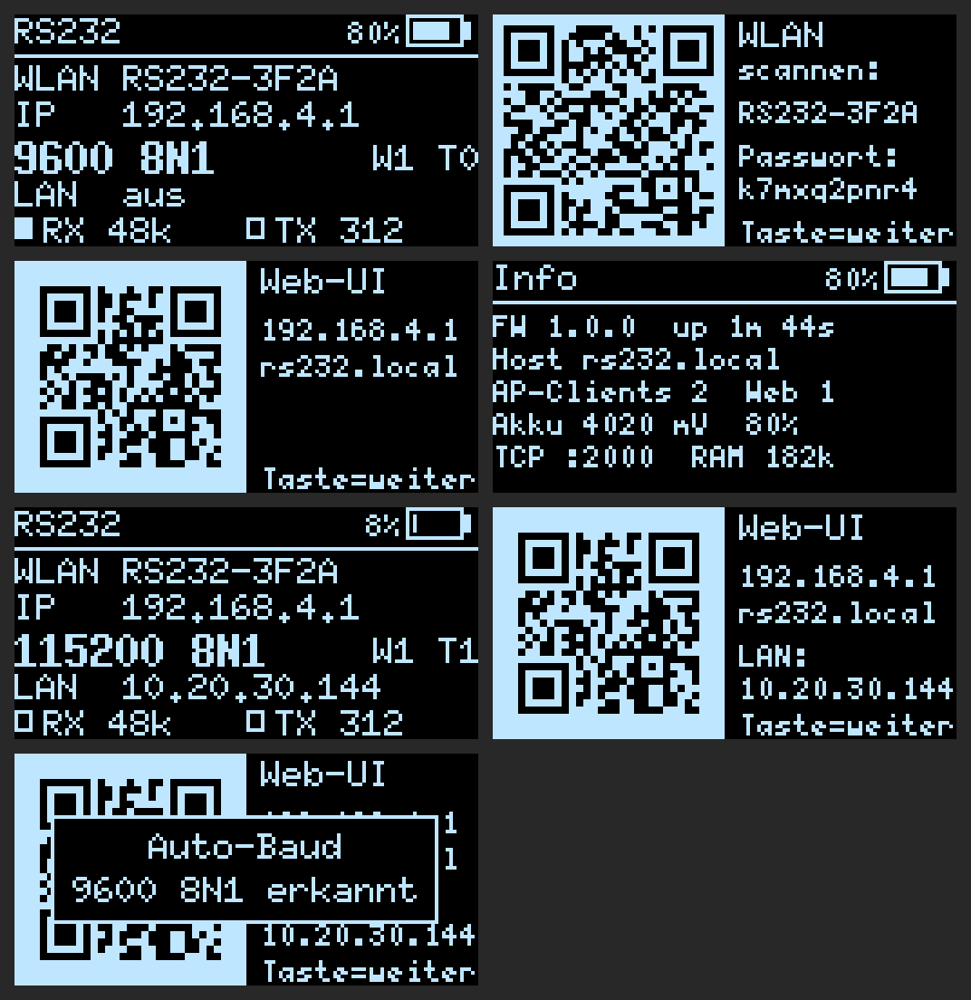
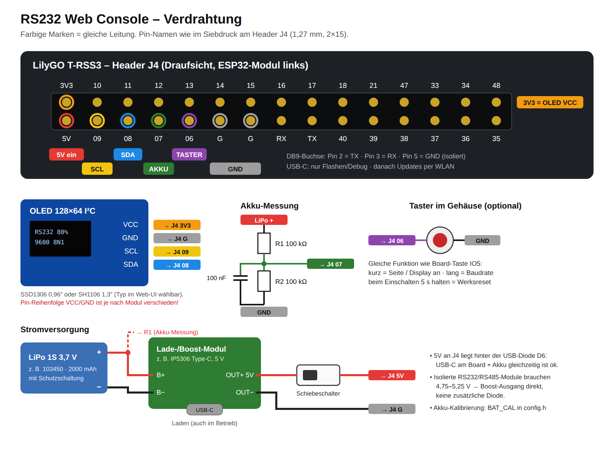
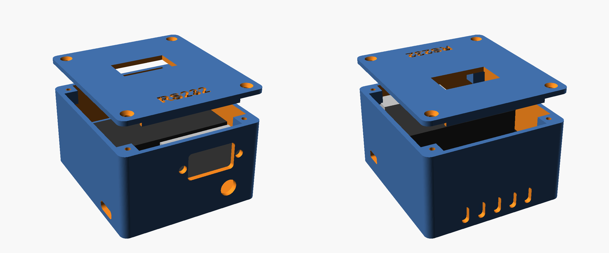

# RS232 Web Console – LilyGO T-RSS3

Mobiler serieller Konsolenzugang per WLAN: ESP32-S3 (LilyGO T-RSS3) mit isoliertem RS232-Port, OLED, Akku und Web-Terminal im Browser. Du verbindest dein Handy oder Notebook mit dem Hotspot des Geräts und öffnest `http://192.168.4.1`. Eine App ist nicht nötig.

> **Drei Hardware-Varianten, eine Firmware:**
> - **LilyGO T-RSS3** – die Zielhardware, isolierter RS232-Port, OLED, Akku (dieses Dokument)
> - **ESP32 DevKit + MAX3232 (HW-044)** – der Schnelltest ohne Spezialhardware: **[MOCKUP.md](MOCKUP.md)**
> - **VIEWE 5" Touchpanel (ESP32-S3, 800×480)** – mit Touch-Oberfläche am Gerät und SD-Karte: **[PANEL.md](PANEL.md)**


## Funktionen

- **Web-Terminal** (xterm.js, offline im Flash eingebettet) mit **Eingabezeile + Senden** und Befehlsverlauf (↑/↓), dazu eine Sondertasten-Leiste fürs Handy: Ctrl (einrastend), Tab, `?`, Pfeiltasten, Space, `q`, ^C, ^Z, Ctrl-Shift-6, Esc
- **Break senden** (250/500/1000 ms) für ROMmon/Passwort-Recovery. In der Kopfzeile musst du zweimal tippen, damit nichts versehentlich ausgelöst wird.
- **Auto-Baud**: probiert 9600, 115200, 19200, 38400 und 57600 mit einem Enter durch.
- **Mitschnitt**: die komplette Sitzung (bis 8 MB) als `.log` speichern, auf Wunsch bereinigt (ohne `--More--`, Backspaces und ANSI-Codes).
- **Bis zu 4 serielle Ports** mit je eigenem Terminal-Reiter, Namen, Einstellungen, Mitschnitt und Raw-TCP-Port (2000–2003). Die GPIOs weist du im Web-UI zu (Menü → Ports).
- **Dateien senden per XMODEM, XMODEM-1K und YMODEM** (ROMmon-Recovery, U-Boot `loadx`/`loady`). Das Protokoll läuft im ESP32, der Browser streamt nur die Datei.
- **Konfigurationen** auf dem Gerät speichern und per Klick abspielen: wartet auf den Prompt, fragt `{{Platzhalter}}` ab, `@expect`/`@pause`/`@break`, stoppt bei `% Invalid input`.
- **Wiederverbinden ohne Datenverlust**: Das Gerät puffert die letzten 16 kB. Nach einem WLAN-Abbruch bekommt der Browser genau die verpassten Bytes nachgeliefert.
- **Mehrere Clients** gleichzeitig (bis 5 Browser). Dazu **Raw-TCP** (Port 1 = 2000, Port 2 = 2001 …) für PuTTY („Raw“), SecureCRT oder `nc`.
- **OLED** mit vier Seiten: Status, WLAN-QR (Handy-Kamera → automatisch verbinden), URL-QR, Info
- **Akkuanzeige** in Prozent und mV auf OLED und im Web (LiPo oder NiCd/NiMH, Mess-Pin und Teiler einstellbar). Status-LED (WS2812) für Clients, Traffic und schwachen Akku.
- **Firmennetz (802.1X):** WLAN-Client mit **WPA2/WPA3-Enterprise** – EAP-TLS mit Zertifikat (`.p12`/`.pfx`, `.pem`, `.p7b`), PEAP-MSCHAPv2 oder EAP-TTLS. Zertifikate lädst du im Web-UI hoch, Schlüsselpaar und Zertifikatsantrag (CSR) kann das Gerät auch selbst erzeugen.
- **HTTPS für die Web-Oberfläche** (Port 443, TLS 1.2) mit eigenem Zertifikat – wahlweise dem 802.1X-Zertifikat – oder einem, das sich das Gerät selbst ausstellt. Im Firmennetz lässt sich HTTP auf HTTPS umleiten.
- **Hotspot mit Captive Portal:** Das Handy öffnet die Konsole nach dem Verbinden automatisch. Der Hotspot wählt beim Start den freiesten Kanal (1/6/11), Kanal und Sendeleistung sind im Setup einstellbar. Optional zusätzlich WLAN-Client (z. B. Labor-WLAN), mDNS `http://rs232.local`, Diagnose unter `/ping`
- **Firmware-Update per Browser** (OTA), Werksreset per Taste



## Teststand

| Bereich | Stand |
|---|---|
| Firmware | kompiliert ohne Warnung gegen Arduino-ESP32 2.0.17: T-RSS3 (ESP32-S3, 4 MB Flash) und Mockup (ESP32 DevKit). Flash ca. 1,4 MB (71 % der OTA-Partition), RAM 70 kB statisch |
| Web-UI | 35 automatisierte Tests im Headless-Chromium (iPhone-Profil) gegen den Geräte-Simulator (`tools/mock_device.js`), keine JS-Fehler |
| Firmware am PC | Der echte C++-Code (WebServer, WebSockets, Captive-DNS, Replay, 4 Ports, XMODEM/YMODEM, Konfig-Speicher) läuft am PC gegen nachgebildetes WLAN und serielle Leitungen mit echter Baudrate. Getestet mit Chromium (iPhone-Profil) und **WebKit, der Engine von Safari** |
| XMODEM/YMODEM | Übertragungen in die echten Linux-Empfänger `rx` und `rb` (lrzsz): XMODEM-1K, XMODEM mit Prüfsumme, YMODEM mit Name und exakter Größe, eingestreute CRC-Fehler, verirrte NAKs während eines Blocks, Empfänger ohne 1K-Blöcke, Abbruch durch Empfänger und Benutzer, WLAN-Abriss mit Fortsetzung. Dateien bitgenau verglichen |
| OLED | alle Seiten am PC mit U8g2 gerendert. QR-Codes maschinell dekodiert (WLAN-Login + URL korrekt) |
| Captive Portal | DNS-Antwortlogik am PC mit echten DNS-Paketen getestet (A, AAAA, HTTPS-Typ, EDNS) |
| Zertifikate | 68 Tests gegen mit OpenSSL erzeugte Dateien: PKCS#12 mit AES-256 und mit 3DES/RC2 (alte Windows-Exporte), ohne Passwort, ohne MAC, mit Umlaut-Passwort, PEM/DER/PKCS#7, verschlüsselte Schlüssel (PKCS#8 mit AES/3DES, klassisch mit AES/3DES), falsche Passwörter, nicht passende Schlüssel, Ed25519, CSR auf dem Gerät (Signatur mit OpenSSL geprüft, von einer Test-CA signiert und wieder eingespielt) |
| 802.1X / HTTPS | am PC: Zertifikats-Upload über die Web-Oberfläche, an den Supplicant übergebene PEM-Puffer, HTTPS-Seite und Terminal über `wss://` in Chromium **und WebKit (Safari-Engine)**, Prüfung der Kette gegen die Geräte-CA, HTTPS-Zwang im LAN, Lasttest (40 Anfragen nacheinander, 6 parallel, 58 kB über eine TLS-Sitzung, kein Leerlauf-Spin). **Anmeldung an einem echten RADIUS-Server steht noch aus** |
| **Echte Hardware** | Mockup (DevKit + HW-044) läuft mit Port 1. **Ports 3/4 (Software-UART) und T-RSS3 noch nicht auf echter Hardware getestet**, T-RSS3-Pins stammen aus dem LilyGO-Schaltplan |
| Gehäuse | parametrisch in OpenSCAD. **Die Platinenmaße sind Schätzwerte, vor dem Druck nachmessen** |

## Teileliste

| # | Teil | Hinweis |
|---|---|---|
| 1 | LilyGO **T-RSS3** (ESP32-S3, RS232 + RS485 isoliert) | ca. 22 USD bei LilyGO |
| 2 | OLED 128×64 I²C, **SSD1306 0,96″** oder **SH1106 1,3″** | 3,3 V, 4-Pin. Typ ist im Web-UI umschaltbar |
| 3 | LiPo 1S 3,7 V, z. B. **103450 / 2000 mAh**, mit Schutzschaltung | Maße 50×34×10 mm passen ins Gehäuse |
| 4 | Lade-/Boost-Modul mit 5-V-Ausgang, z. B. **IP5306 Type-C** | Laden auch im Betrieb möglich. Alternative: Adafruit PowerBoost 1000C |
| 5 | Schiebeschalter SS12D00 | im 5-V-Ausgang |
| 6 | 2× Widerstand 100 kΩ, 1× Kondensator 100 nF | Akku-Spannungsteiler |
| 7 | optional: Taster 7 mm (Schließer) | Bedienung im geschlossenen Gehäuse |
| 8 | Stiftleiste **1,27 mm** 2×15 oder dünne Litze (AWG 28–30) | J4 hat 1,27-mm-Raster |
| 9 | Adapter **DB9-Stecker (male) → RJ45-Buchse**, Modular-Bausatz | siehe [Konsolenkabel](#konsolenkabel) |
| 10 | 4× Schraube M2,5×6 selbstschneidend | Deckel |

## Verdrahtung



| Von | Nach (J4, Siebdruck) | Funktion |
|---|---|---|
| OLED VCC | `3V3` (obere Reihe, außen) | 3,3 V |
| OLED GND | `G` | Masse |
| OLED SCL | `09` | I²C Takt |
| OLED SDA | `08` | I²C Daten |
| Teiler-Mitte (R1 zu LiPo+, R2 zu GND, 100 nF parallel zu R2) | `07` | Akku-Spannung (ADC) |
| Taster (gegen GND) | `06` | wie Board-Taste IO5 |
| Boost-Modul OUT+ **über Schiebeschalter** | `5V` (untere Reihe, außen) | Versorgung |
| Boost-Modul OUT− | `G` | Masse |

Der `5V`-Pin liegt laut Schaltplan hinter der USB-Diode D6. Du kannst USB-C am Board und den Akku gleichzeitig angeschlossen haben. Die isolierten RS232/RS485-Module brauchen 4,75–5,25 V. Deshalb geht der Boost-Ausgang **ohne** zusätzliche Diode direkt an `5V`.

Alle Pins lassen sich in `src/config.h` ändern.

## Konsolenkabel

Laut LilyGO-Schaltplan ist die DB9 am Board eine **Buchse (female)** mit **Pin 2 = TX (Ausgang), Pin 3 = RX (Eingang), Pin 5 = GND**. Sie ist also wie ein Modem (DCE) belegt.

**Vorher messen:** Board einschalten und am DB9 Pin 2 gegen Pin 5 messen. Der TX-Ausgang liegt im Ruhezustand deutlich negativ (typisch −5 V). Liegt die Spannung stattdessen an Pin 3, sind 2 und 3 in der Tabelle unten zu tauschen.

**Empfohlen: DB9-Stecker → RJ45-Buchse (Modular-Bausatz) + normales Cisco-Rollover-Kabel** (das hellblaue flache Kabel, RJ45↔RJ45)

| DB9-Stecker (Adapter) | RJ45-Buchse (Adapter) |
|---|---|
| Pin 2 (TX vom Board) | Pin 3 |
| Pin 3 (RX zum Board) | Pin 6 |
| Pin 5 (GND) | Pin 4 **und** Pin 5 |

Damit funktionieren RJ45-Konsolen mit Cisco-Pinout (Cisco, Fortinet, Aruba/HPE, Juniper u. a.) direkt über das Rollover-Kabel.

Weitere Fälle:
- **Vorhandenes Cisco-Kabel RJ45 ↔ DB9-Buchse:** Dazwischen gehört ein DB9-**Nullmodem**-Adapter Stecker/Stecker.
- **Geräte mit DB9-Stecker (DTE, z. B. Server-COM-Port, USV):** direkt oder mit 1:1-Verlängerung (Stecker/Buchse).

## Firmware flashen

1. VS Code und die Erweiterung **PlatformIO** installieren, dann diesen Ordner öffnen.
2. T-RSS3 per USB-C anschließen und in der PlatformIO-Leiste **Upload** klicken. Libraries und Toolchain werden automatisch geladen. Die Web-UI wird beim Build aus `web/` nach `src/web_assets.h` gepackt.
3. Falls der Upload nicht startet: **BOOT** halten, **RST** kurz drücken, BOOT loslassen, dann erneut Upload.
4. Der serielle Monitor (115200) zeigt beim Start SSID, Passwort und URL an.

Spätere Updates gehen ohne Kabel: Web-UI → Menü → **Setup** → Firmware-Update → `.pio/build/t-rss3/firmware.bin` hochladen.

## Erste Inbetriebnahme

1. Einschalten. Beim ersten Start erzeugt das Gerät einen Hotspot **`RS232-XXXX`** mit **zufälligem Passwort** und speichert ihn.
2. Taste kurz drücken, bis die Seite **„WLAN scannen“** erscheint, und den QR-Code mit der Handy-Kamera scannen.
3. Nächste Seite: **Web-UI-QR** scannen oder `http://192.168.4.1` öffnen.
4. Android fragt eventuell „Internet nicht verfügbar“ → **Verbindung beibehalten**. iOS bleibt trotz „Kein Internet“ verbunden.

## Bedienung

**Taste (IO5 am Board bzw. IO6 im Gehäuse)**

| Aktion | Wirkung |
|---|---|
| kurz | Display einschalten / nächste Seite (Status → Ports → WLAN-QR → URL-QR → Info) |
| lang (> 1 s) auf der Statusseite | nächste Baudrate von Port 1: 9600 → 19200 → 38400 → 57600 → 115200 |
| beim Einschalten 5 s halten | Werksreset (neues Hotspot-Passwort) |

**Status-LED:** blau = bereit · grün = Client verbunden · weiß blitzend = Datenverkehr · gelb blinkend = Auto-Baud · rot blinkend = Akku schwach · magenta = Break

**Web-UI**
- **Eingabezeile** unten: Befehl tippen, **Senden** oder Enter. Die Zeile geht mit CR raus (umstellbar unter Seriell). ↑/↓ = Verlauf, **Tab** und **?** schicken den getippten Text plus Taste (Befehlsergänzung/Hilfe am Switch).
- Direkt ins Terminal tippen geht auch: Jede Taste geht sofort raus, gut für Passwörter und `--More--`. Die Leiste unten liefert Tab, `?`, Pfeile usw. **Ctrl** rastet für eine Taste ein (Ctrl → `z` = ^Z). **⌨** blendet die Tastatur ein oder aus.
- Oben: Verbindungspunkt · Baud-Chip des aktiven Ports (öffnet die seriellen Einstellungen) · Akku (nur mit Messung) · **Break** (2× tippen) · Menü. Darunter bei mehreren Ports ein Reiter pro Port.
- Menü: **Seriell** (Baud, Format, Auto-Baud, Break-Dauer des aktiven Ports) · **Sitzung** (Log, Schriftgröße, Datei senden per XMODEM/YMODEM) · **Konfig** (gespeicherte Konfigurationen abspielen) · **Ports** (Pins, Namen, Akku-Messung) · **Gerät** (Status) · **Setup** (WLAN, Passwort, Display, LED, Firmware-Update, Werksreset)
- Details zu Ports, Dateiübertragung und Konfigurationen: [MOCKUP.md](MOCKUP.md#7-bis-zu-4-serielle-ports)
- Tipp: Im Querformat passen auf dem Handy 80+ Spalten.

**Notebook:** Die Web-UI funktioniert genauso im Browser. Alternativ gibt es Raw-TCP: `nc 192.168.4.1 2000` oder PuTTY mit Verbindungstyp **Raw**, Port 2000 (Port 2 = 2001 usw.). Break geht nur über die Web-UI.


## Einstellungen & Sicherheit

- **Hotspot:** WPA2 mit zufälligem 10-Zeichen-Passwort. Es steht auf dem OLED, du kannst es im Setup ändern.
- **Zusätzlich ins WLAN einbuchen:** Netz → SSID/Sicherheit. Das Gerät ist dann auch über die LAN-IP erreichbar (steht auf dem OLED), der Hotspot bleibt aktiv. Der Hotspot wechselt dabei auf den Kanal des WLANs, Handys verbinden sich kurz neu.
- **Web-Passwort** (Benutzer `admin`): Ist im LAN-Betrieb dringend zu empfehlen. Es schützt Web-UI, Terminal (Session-Token), Einstellungen und OTA.
- **Raw-TCP** hat keine Authentifizierung. Solange das Gerät im LAN hängt, nimmt es TCP-Verbindungen deshalb **nur von Hotspot-Clients** an. Abschaltbar im Setup.
- HTTP im Hotspot ist unverschlüsselt, den Schutz übernimmt die WLAN-Verschlüsselung. Im Firmennetz kannst du HTTPS erzwingen (siehe unten).

## Firmennetz: 802.1X und HTTPS

Alles dazu steht im Web-UI unter **Menü → Netz**.


### WLAN-Client mit 802.1X

| Verfahren | Was das Gerät braucht |
|---|---|
| WPA2/WPA3-Personal | SSID + Passwort |
| **EAP-TLS** (zertifikatsbasiert) | Client-Zertifikat **mit privatem Schlüssel** (Slot „Client“), dazu das CA-Zertifikat des RADIUS-Servers |
| PEAP-MSCHAPv2 | Benutzer + Passwort, CA-Zertifikat empfohlen |
| EAP-TTLS (MSCHAPv2 oder PAP) | Benutzer + Passwort, CA-Zertifikat empfohlen |

- **Identität (außen)**: Wenn leer, nimmt das Gerät bei EAP-TLS den CN aus dem Zertifikat, sonst den Benutzernamen.
- **RADIUS-Server prüfen**: Mit hinterlegtem CA-Zertifikat prüft das Gerät die Zertifikatskette des Servers. Einen Abgleich des Servernamens (Domain-Match) kann das ESP32-SDK 4.4 nicht, die Kette wird also gegen die CA geprüft, nicht gegen einen konkreten Servernamen.
- **WPA3-Enterprise**: WPA2/WPA3-Transition-Netze funktionieren (PMF wird unterstützt). Der **192-Bit-Modus (Suite B)** ist in diesem SDK nicht aktiviert, ein Netz, das ausschließlich Suite B erlaubt, geht damit nicht.
- Nach dem Hochladen eines neuen Zertifikats meldet sich das WLAN erst nach einem **Neustart** damit an (das Web-UI weist darauf hin).
- Fehlersuche: Menü → Gerät zeigt den Abmeldegrund, z. B. „Grund 23: 802.1X abgelehnt (Zertifikat/Identität prüfen)“.

### Zertifikate hochladen

Akzeptierte Formate: **PKCS#12** (`.p12`, `.pfx` – auch die alten Windows-Exporte mit 3DES/RC2 und die neuen mit AES), **PEM** (Zertifikat, Schlüssel, Kette), **DER** (`.crt`, `.cer`), **PKCS#7** (`.p7b`, die „Zertifikatskette“ der Microsoft-CA) und einzelne Schlüssel (auch verschlüsselt, PKCS#8 oder klassisch mit `Proc-Type: ENCRYPTED`).

- Zertifikat und Schlüssel dürfen getrennt hochgeladen werden, das Gerät ordnet sie über den öffentlichen Schlüssel zu.
- Zwischenzertifikate aus der Datei werden mitgespeichert und mitgeschickt.
- Die Karten im Web-UI zeigen Inhaber, Aussteller, Laufzeit, Schlüsseltyp, Verwendungszweck (EKU), alternative Namen (SAN) und den SHA-256-Fingerabdruck.

### Schlüssel auf dem Gerät erzeugen (CSR)

Netz → „Antrag erzeugen“: Das Gerät erzeugt ein Schlüsselpaar (RSA 2048 oder ECDSA P-256) und einen CSR mit SAN und den Verwendungszwecken *clientAuth* und *serverAuth*. Der private Schlüssel verlässt das Gerät nie. Den Antrag von der Firmen-CA signieren lassen und das Zertifikat hochladen – der passende Schlüssel wird automatisch zugeordnet. Bei einer Microsoft-CA muss die Vorlage „Antragsteller liefert SAN“ erlauben, sonst setzt die CA eigene Namen.

### HTTPS für die Web-Oberfläche

- **Zertifikat**: entweder ein eigenes (Slot „HTTPS“), oder das 802.1X-Client-Zertifikat mitbenutzen – das geht nur, wenn es *serverAuth* im EKU hat und der aufgerufene Name im SAN steht (die Microsoft-Vorlage „Computer“ erfüllt beides). Liegt nichts vor, stellt sich das Gerät **selbst eine kleine CA und ein Zertifikat** aus (Namen `rs232`, `rs232.local`, `192.168.4.1` und die aktuelle LAN-IP, Laufzeit unter 825 Tagen wie von Apple verlangt).
- **iPhone/iPad**: Für die selbst ausgestellte Variante die **Geräte-CA** herunterladen (Netz → Geräte-CA), als Profil installieren und unter *Einstellungen → Allgemein → Info → Zertifikatsvertrauenseinstellungen* aktivieren. Ohne das vertraut Safari dem Gerät nicht, und die Terminal-Verbindung (WebSocket über TLS) kommt nicht zustande.
- **Im Firmennetz nur HTTPS**: HTTP-Aufrufe aus dem LAN werden auf HTTPS umgeleitet, unverschlüsselte Terminal-Verbindungen aus dem LAN werden abgelehnt. Im Hotspot bleibt HTTP erreichbar, sonst funktioniert die automatische Anmeldeseite am iPhone nicht.
- Technisch: eigener TLS-Frontend-Task (mbedTLS, TLS 1.2, max. 3 gleichzeitige Sitzungen, ~35 kB RAM je Sitzung, Sitzungs-Cache für schnelle Wiederverbindungen).

### Grenzen, die man kennen sollte

- Die **privaten Schlüssel liegen unverschlüsselt im Flash** (ohne Flash-Encryption). Wer das Gerät in die Hand bekommt, kann sie auslesen. Also ein eigenes Gerätezertifikat verwenden, das sich sperren lässt – kein Benutzerzertifikat.
- Ohne Web-Passwort kommt im Firmennetz jeder an die Konsolen. Erst Passwort setzen, dann ins LAN.
- Der Werksreset (Web-UI oder Taste beim Einschalten) löscht Zertifikate **und** Schlüssel.
- Der ESP32 hat 16 Netzwerk-Sockets. HTTPS belegt je Sitzung zwei davon – wer HTTPS zusammen mit vier Raw-TCP-Ports und mehreren Browsern nutzt, sollte Raw-TCP abschalten.

## Akku

- **Laufzeit (Schätzung, nicht gemessen):** ca. 0,8–1 W Gesamtverbrauch (ESP32 im AP-Betrieb, zwei isolierte DC/DC-Module, OLED). Mit 2000 mAh sind das etwa **6–8 Stunden**. Genau misst du es mit einem USB-Messgerät am Ladeeingang.
- **Kalibrieren:** Akkuspannung mit dem Multimeter messen und mit dem Wert im Web-UI (Gerät → Akku) vergleichen. Dann `BAT_CAL` in `src/config.h` auf `echt / angezeigt` setzen (z. B. `1.03`).
- Den Tiefentladeschutz übernehmen Boost-Modul und die Schutzschaltung der Zelle. Die Firmware warnt bei ≤ 10 %.
- IP5306-Module schalten bei sehr kleiner Last (< ca. 50 mA) ab. Das Gerät zieht dauerhaft mehr, sollte also nicht betroffen sein. Falls doch, nimm ein Modul ohne Auto-Off (z. B. PowerBoost 1000C).

## Gehäuse



`case/rs232_console_case.scad` ist parametrisch, am einfachsten in OpenSCAD mit dem **Customizer** bearbeiten. Außenmaß mit den Standardwerten: **ca. 60 × 67 × 37 mm**. Die beiden STL-Dateien entsprechen den Standardwerten. Sie eignen sich zum Probedruck, passen aber erst nach dem Nachmessen sicher.

**Nachmessen (Messschieber):** Platinenbreite/-tiefe, höchstes Bauteil über der Platine, Mitte der DB9-Buchse (Abstand von der linken Platinenkante und Höhe über der Platine), Akku- und Lademodul-Maße, Position der USB-C-Buchse am Lademodul, OLED-Modul und Lage des sichtbaren Glasbereichs.

Aufbau von unten nach oben:
1. **Firmware vorher flashen** und alles offen testen.
2. Akku (hinten) und Lademodul (vorne links, USB-C zur linken Wand) auf den Boden kleben. Schiebeschalter in den Schlitz rechts, Taster in die Front unter die DB9.
3. Die T-RSS3 liegt auf den Stegen der Seitenwände. Die DB9-Sechskantbolzen abschrauben und durch die Frontwand wieder eindrehen, das fixiert die Platine.
4. Das OLED sitzt im Rahmen unter dem Deckel (Pins nach hinten), mit Heißkleber fixieren. Deckel mit 4× M2,5×6 verschrauben.

Druck: PETG oder PLA, 0,2 mm Schichthöhe, 3 Wände, ohne Stützen. Den Deckel mit der Oberseite nach unten drucken.

## Fehlersuche

| Problem | Lösung |
|---|---|
| Terminal bleibt leer | Enter drücken · **Auto-Baud** · Adapter-Belegung prüfen (TX/RX, siehe Messung oben) · Rollover-Kabel statt Patchkabel? |
| Zeichensalat | falsche Baudrate → Auto-Baud oder Baud-Chip |
| OLED dunkel | VCC/GND vertauscht? · SDA=08, SCL=09 · Adresse 0x3C/0x3D wird automatisch gesucht · USB-Log zeigt „OLED: nicht gefunden“ |
| OLED Bild verschoben/Müll | falscher Controller → Setup: SSD1306 ↔ SH1106 |
| Web-UI lädt nicht | Handy hat den Hotspot wegen „kein Internet“ verlassen · `192.168.4.1` statt `.local` verwenden (Android) · `http://192.168.4.1/ping` testen · USB-Log lesen (Tabelle in [MOCKUP.md](MOCKUP.md#seite-lädt-nicht-diagnose)) · Setup: festen Kanal oder mehr Sendeleistung |
| Akku-% unplausibel | Teiler 100k/100k an `07`? · `BAT_CAL` kalibrieren |
| Upload scheitert | BOOT halten + RST drücken (Download-Modus) |
| Passwort vergessen | steht auf dem OLED (Seite „WLAN scannen“) und im USB-Log · sonst Werksreset per Taste |

## Web-UI ohne Hardware entwickeln

```bash
npm install ws
node tools/mock_device.js     # -> http://localhost:8080 (simuliert Gerät + Cisco-CLI)
```

## Projektstruktur

```
platformio.ini            Build-Konfiguration (Arduino-ESP32 2.0.17): t-rss3, esp32dev-max3232
MOCKUP.md                 Schnelltest mit ESP32 DevKit + MAX3232 (HW-044)
firmware/                 fertige Binärdateien für das Mockup (Browser-Flasher / OTA)
src/config.h              Board-Profile, Pins, Kalibrierung, Ports, Defaults
src/main.cpp              Setup/Loop, Tasten
src/serial_bridge.*       bis zu 4 UARTs (2 Hardware, 2 Software), Replay-Puffer, Break, Auto-Baud
src/xfer.*                XMODEM / XMODEM-1K / YMODEM-Sender
src/configs.*             gespeicherte Konfigurationen (LittleFS)
src/net.*                 WLAN (inkl. 802.1X), HTTP, WebSocket (Port 81), Raw-TCP, OTA
src/certs.*               Zertifikatsspeicher (PKCS#12/PEM/DER/PKCS#7), CSR, Geräte-CA
src/https.*               TLS-Frontend Port 443 (HTTPS + WSS)
src/legacy_ciphers.*      DES/3DES/RC2 zum Lesen alter PKCS#12-Dateien
src/display.*             OLED-Seiten inkl. QR-Codes
src/power.*               Akku-Messung (LiPo / NiCd, Pin + Teiler einstellbar)
src/status_led.*          WS2812
src/settings.*            Einstellungen (NVS)
src/web_assets.h          generiert aus web/ (nicht von Hand bearbeiten)
web/                      Web-UI (index.html, app.js, style.css, xterm.js)
tools/embed_web.py        bündelt web/ zu EINER Seite (CSS/JS eingebettet) und packt sie gzip-komprimiert in die Firmware
tools/mock_device.js      Geräte-Simulator für die UI-Entwicklung
case/                     OpenSCAD-Gehäuse + STL (Standardmaße)
docs/                     Verdrahtung, Screenshots
```

Drittsoftware: xterm.js und xterm-addon-fit (MIT, `web/vendor/LICENSE-xterm.txt`), U8g2 (BSD), arduinoWebSockets (LGPL-2.1), ArduinoJson (MIT), EspSoftwareSerial (LGPL-2.1), mbedTLS (Apache-2.0, im ESP32-SDK enthalten). `src/legacy_ciphers.cpp` enthält DES-Code aus LibTomCrypt (Public Domain) und RC2-Code aus PyCryptodome (BSD-2-Clause).
